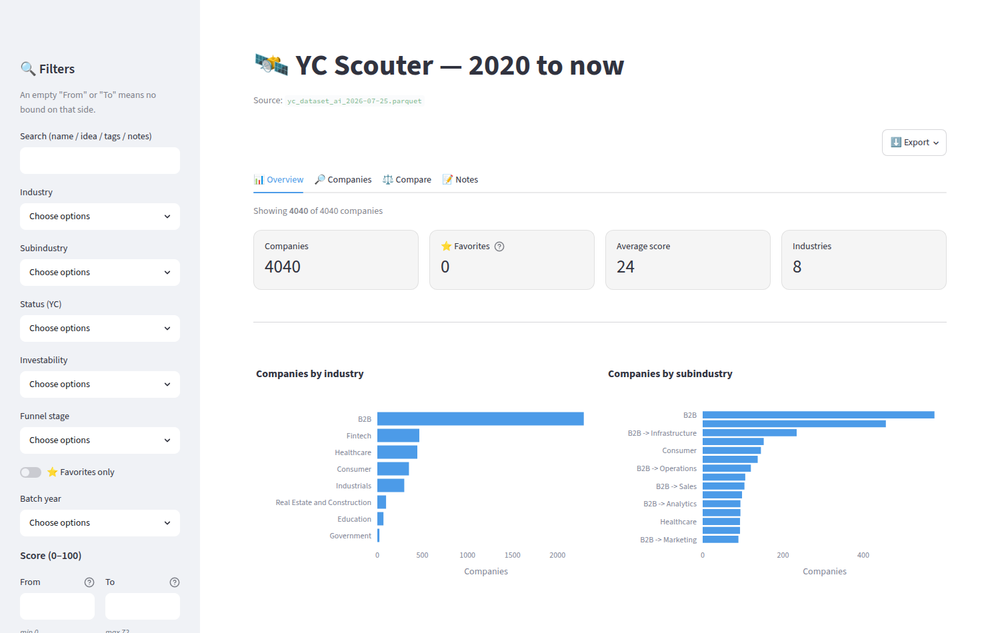
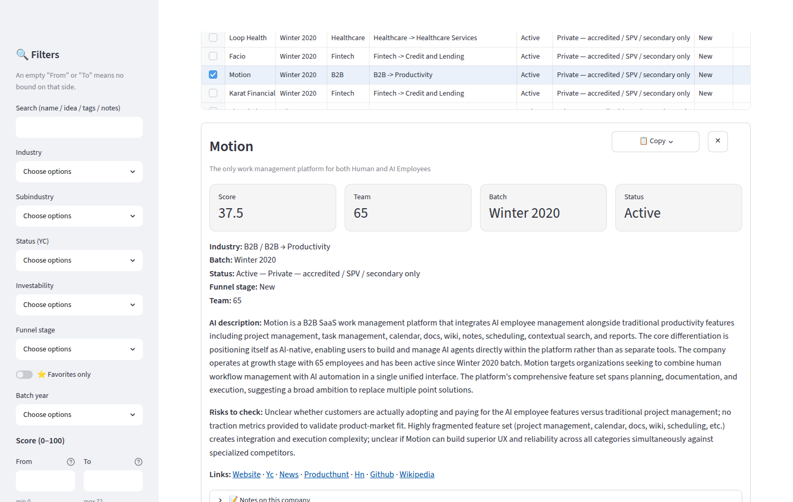

# YC Scouter

**Личный инструмент для поиска и оценки компаний Y Combinator с 2020 года по
сегодня.** Собирает все компании, которые публикует YC, добавляет честные
производные признаки, просит языковую модель написать короткое фактическое описание
и пару конкретных рисков по каждой компании — и показывает всё это в интерактивном
дашборде, где можно фильтровать, строить графики, сравнивать и вести свои заметки.

> 🔗 **Живой дашборд — [nerbi357-yc-scouter.streamlit.app](https://nerbi357-yc-scouter.streamlit.app/)**
> · 🌐 [English version](README.md)

**Несколько тысяч компаний** · батчи 2020–2026 · у каждой есть AI-описание и риски ·
данные пересобираются по нажатию двух кнопок.



---

## Что такое Y Combinator

Y Combinator — американский акселератор, который с 2005 года финансирует компании на
самой ранней стадии; через него прошли Airbnb, Stripe, Dropbox, Coinbase и Reddit.
Условия одинаковы для всех: фиксированная сумма за фиксированную долю. Компании
набираются **батчами** — трёхмесячными наборами, названными по сезону старта (Winter,
Spring, Summer, Fall), — и заканчивают Demo Day, где представляют себя инвесторам.

YC публикует весь свой портфель открыто — именно поэтому этот проект возможен. Но
каталог YC — это *список*: ничего не ранжировано, две компании нельзя поставить
рядом, и негде записать, что вы о них подумали. Этот инструмент закрывает разрыв.

## Что он умеет

- **Искать** — фильтры по индустрии и подиндустрии, статусу YC, investability, году
  батча, размеру команды, score, вашей стадии воронки и тегам; поиск по названиям,
  идеям, описаниям и вашим заметкам.
- **Объяснять** — в карточке компании: собственный one-liner от YC, AI-описание на
  6–7 предложений, 1–2 конкретных риска для проверки и ссылки только на открытые
  источники (сайт, профиль YC, новости, Product Hunt, Hacker News, GitHub,
  Википедия).
- **Сравнивать** — до пяти компаний колонками бок о бок.
- **Помнить** — избранное, теги, личная стадия воронки и свободные заметки; хранятся
  вне приложения, поэтому обновление данных их не трогает.
- **Выгружать** — отфильтрованную выборку в CSV, Excel или Parquet.
- **Не выдумывать** — см. [Честность о данных](#честность-о-данных).



## Как читать цифры

Часть полей приходит от YC, часть посчитана этим проектом. Карточка их не смешивает —
и эта таблица тоже.

| Поле | Откуда | Что значит |
|---|---|---|
| `batch` | YC | Набор, в который попала компания: сезон и год, например *Winter 2020*. |
| `status` | YC | *Active*, *Inactive*, *Acquired* или *Public*. |
| `stage` | YC | Грубая отметка размера: *Early* или *Growth*. |
| `top_company`, `is_hiring` | YC | Собственные флаги YC, передаются без изменений. |
| `investability` | **этот проект** | Прямое прочтение `status`: активная частная компания доступна только через квалифицированный раунд, SPV или вторичную сделку; поглощённая или неактивная недоступна вовсе. Это утверждение о доступе — **не** прогноз и не рекомендация. |
| `score` (0–100) | **этот проект** | Прозрачная взвешенная сумма дешёвых сигналов: флаг *top company* от YC (вес 3), свежесть батча (2), открытые вакансии (1), размер команды (1), содержательное описание (0.5) и богатство тегов (0.5). Детерминирован и перенастраивается в [`src/yc_scouter/score.py`](src/yc_scouter/score.py). Шкала намеренно строгая: в прогоне 2026-07-25 медиана — 23.4, максимум — 72.9. |
| `ai_description`, `ai_risks` | **языковая модель** | 6–7 предложений и 1–2 риска для проверки, сгенерированы из собственного публичного текста компании и везде помечены как машинные. |

## Как это устроено

```
File 1  сбор       →  датированный Base   (бесплатно, повторяемо, без ключей)
File 2  обогащение →  датированный AI     (стоит денег, возобновляемо, с кэшем)
app.py  чтение     →  дашборд             (ничего не скачивает и не тратит)
```

- **File 1** — `notebooks/01_dataset_base.ipynb`: забирает все компании YC из
  открытого [`yc-oss/api`](https://yc-oss.github.io/api/companies/all.json),
  нормализует, добавляет `investability`, ссылки для изучения и score 0–100, пишет
  `yc_dataset_base_<дата>.parquet` + `.xlsx`.
- **File 2** — `notebooks/02_ai_summary.ipynb`: добавляет `ai_description` и
  `ai_risks` через **Claude by Anthropic** (опционально Groq), пишет
  `yc_dataset_ai_<дата>.parquet` + `.xlsx`. Результаты кэшируются по ключу
  `(компания, модель, версия промпта)`: полный прогон 2026-07-24 стоил **$7.14** за
  ~4000 компаний, а обновление на следующий день — **полцента** за 3 новые. Перед
  тратами проверяются ключ, баланс и наличие модели.
- **Дашборд** — `app.py`: приложение Streamlit, читающее самый свежий датированный
  датасет.
- **Две кнопки** — GitHub Actions запускают File 1 и File 2 вручную. Расписания нет
  намеренно: ничего не меняется и не тратится, пока вы сами не попросите.

Подробная архитектура, промпты и правила устройства:
[`DOCS/HOW_IT_WORKS.md`](DOCS/HOW_IT_WORKS.md) *(на английском)*.

## Карта репозитория

| Путь | Что это |
|---|---|
| `app.py` | дашборд — единственное, что запускается |
| `src/yc_scouter/` | вся логика; её импортируют тетради, CI и дашборд |
| `src/tests/` | набор тестов; сеть и LLM замоканы, прогон ничего не стоит |
| `notebooks/` | File 1 и File 2 — тонкие обёртки над пакетом |
| `data/` | датированные датасеты (Parquet + Excel) и кэш AI |
| `DOCS/` | документация для людей (см. ниже) |
| `AI_USAGE/` | рабочие файлы для ИИ-агента: инструкции, память проекта, бэклог идей |
| `.github/workflows/` | две кнопки обновления |
| `.streamlit/` | конфиг дашборда + шаблон секретов |
| `.claude/` | конфигурация агента, с которым проект собирался |

## Быстрый старт

```bash
pip install -r requirements.txt --require-hashes    # зафиксированные версии с хешами
streamlit run app.py                                # дашборд
pytest                                              # тесты
```

Пайплайн запускается через тетради (Colab или `papermill`) либо через две кнопки в
GitHub Actions. Для AI-шага нужен `ANTHROPIC_API_KEY` (или `GROQ_API_KEY`); без
ключа AI-колонки заполняются заглушкой и ничего не списывается.

Развернуть собственную копию — хостинг, заметки, переживающие перезапуск, безопасный
шеринг ссылки: [`DOCS/HOW_TO_DEPLOY_DASHBOARD.md`](DOCS/HOW_TO_DEPLOY_DASHBOARD.md).

## Документация

Вся документация — на английском, чтобы проект читался кем угодно.

- [`DOCS/HOW_IT_WORKS.md`](DOCS/HOW_IT_WORKS.md) — архитектура, источник данных и
  производные поля, промпты и контроль стоимости, контракт воспроизводимости и
  правила, по которым построен дашборд.
- [`DOCS/HOW_TO_DEPLOY_DASHBOARD.md`](DOCS/HOW_TO_DEPLOY_DASHBOARD.md) — пошаговый
  деплой с нуля.
- [`DOCS/HOW_TO_UPDATE.md`](DOCS/HOW_TO_UPDATE.md) — чек-лист обслуживания: две
  кнопки, ключи, модели, зависимости, что ломается и что с этим делать.
- [`AI_USAGE/PROJECT_MEMORY.md`](AI_USAGE/PROJECT_MEMORY.md) — **начните отсюда, если
  продолжаете проект с ИИ-агентом**: решения и их причины, текущее состояние,
  открытые задачи. Рядом [`AI_INSTRUCTIONS.md`](AI_USAGE/AI_INSTRUCTIONS.md) (как
  этот агент должен работать) и [`IDEAS.md`](AI_USAGE/IDEAS.md) (предложения, ещё не
  поставленные в план).

## Честность о данных

Источник — открытое сообществом зеркало `yc-oss/api`: без ключей, пересобирается
ежедневно. Все ссылки ведут на свободно доступные страницы; ссылок на Crunchbase и
LinkedIn нет. Cap table, раунды и оценки частных стартапов нигде не публикуются,
поэтому инструмент их не выдумывает: если факта не существует, ячейка остаётся
пустой, а карточка предлагает открытую ссылку. `investability` — честная эвристика
на основе статуса, а не предсказание. AI-поля генерируются **только** из
опубликованного текста самой компании.

Воспроизводимость здесь означает **логику кода, а не данные**: окружение
зафиксировано хешированным lock-файлом, а источник между прогонами законно меняется
— поэтому каждый прогон пишется в свою датированную пару файлов, а прежние
результаты остаются нетронутыми.

## Использование ИИ

Этот репозиторий создан при помощи **Claude by Anthropic** в роли кодового агента.
Автор определил требования, принял все продуктовые и архитектурные решения и
проверил каждое изменение перед вливанием. Агент писал код, тесты и черновики
документации под этим руководством.

Два поля датасета (`ai_description`, `ai_risks`) сгенерированы **Claude** из
открытого исходного текста и везде помечены как машинные; модель, промпты,
параметры и механизмы контроля стоимости описаны в
[`DOCS/HOW_IT_WORKS.md`](DOCS/HOW_IT_WORKS.md). Сгенерированный текст может
наследовать неточности источника, а цифры, которых нет в источнике, модель не
производит.

Ответственность за итоговое содержимое репозитория несёт автор. Как именно агент
направлялся, проверялся и ограничивался — записано в
[`AI_USAGE/AI_INSTRUCTIONS.md`](AI_USAGE/AI_INSTRUCTIONS.md).

## Лицензия

[MIT](LICENSE).
